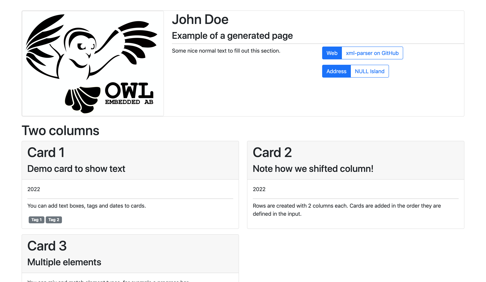

xml-parser

This generator parser an XML file and generates a a webside isung the dash and dash-bootstrap-components python libraries. To try it out, clone the repo and run:

python3 generate.py --input example.xml

This should generate a web page looking as such:

